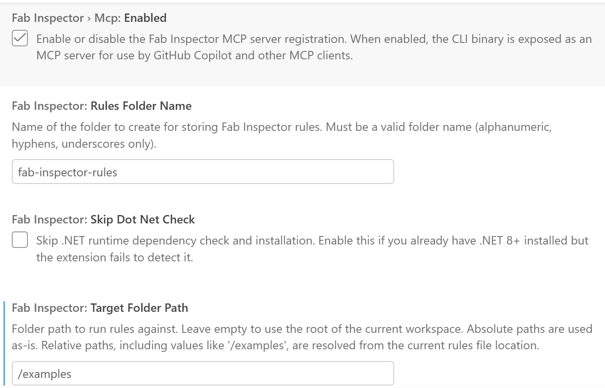
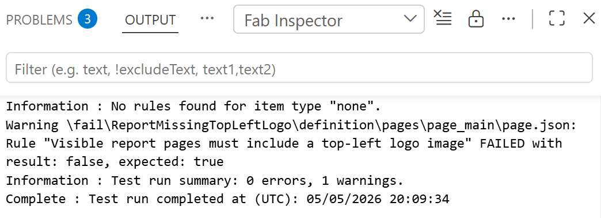

# Fab Inspector Test Harness

A workspace for authoring, testing, and validating [**Fab Inspector**](https://github.com/NatVanG/fab-inspector) rules against Microsoft Fabric item definitions and Fabric API calls. Use it to develop custom governance rules locally, verify them against pass/fail example items, and iterate with AI-assisted rule generation before enforcing them in CI/CD pipelines.

## Repository structure

| Folder | Purpose |
|---|---|
| `fab-inspector-rules/` | Custom Fab Inspector rules. Each rule lives in its own folder with a `rule.json`, a `README.md`, and `examples/pass` and `examples/fail` Fabric item definitions for local testing. |
| `.ai-assets/` | Rule schemas, example rules, and AI skills that help GitHub Copilot author and validate rules. |
| `.github/instructions/` | Copilot instruction files for CLI usage and rule authoring guidance. |

## Pre-requisites

:note: Currently this solution only runs on win-x64.

1. **Visual Studio Code** — download from <https://code.visualstudio.com>.

2. **.NET 8+ SDK** - check which SDK's you've installed by running `dotnet --list-sdks`, if under version 8 download from <https://dotnet.microsoft.com/en-us/download>

3. **Azure CLI** - used to sign in to Microsoft Fabric via Entra. Download from <https://learn.microsoft.com/en-us/cli/azure/install-azure-cli-windows?view=azure-cli-latest&tabs=azure-cli&pivots=winget>

4. **Fab Inspector extension** — install from the VS Code Marketplace, see <https://marketplace.visualstudio.com/items?itemName=NatVanG.fab-inspector>  
   This extension provides the `fab-inspector` CLI to evaluate JSONLogic-based rules against Fabric item definitions and also includes the Fab Inspector MCP server.

5. **Fabric MCP Server extension** — this should get installed automatically as a dependency of the Fab Inspector extension; if not, install from the VS Code MarketPlace, see <https://marketplace.visualstudio.com/items?itemName=fabric.vscode-fabric-mcp-server>. This extension exposes Microsoft Fabric metadata (item definitions, workload schemas, etc.) to GitHub Copilot through MCP, enabling AI-assisted rule authoring with real schema evidence.

6. **GitHub Copilot** :copilot: (recommended) — the repo includes instruction files and skills that let Copilot generate, explain, and validate Fab Inspector rules using natural-language prompts.

## Quick start

1. Clone this repository and open it in VS Code.
2. Install the extensions listed above.
3. Go to the Fab Inspector extension's Settings and set the following:
   
   

4. Start GitHub Copilot chat :copilot:
5. Select the `Fab Inspector Test Harness` agent from the Agent list (Ctrl+.), set the model to `Auto`.
6. Issue a prompt to create a new `Fab Inspector` rule. Your new rule should be created under `fab-inspector-rules/`. Each new rule folder should contain:
   - `rule.json` — the rule definition using Fab Inspector's JSONLogic format.
   - `examples/pass/` — a Fabric item definition(s) that should pass the rule.
   - `examples/fail/` — a Fabric item definition(s) that should fail the rule.
7. The agent should also then automatically run the newly created rule by invoking the Fab Inspector MCP Server's `Inspect` tool. If the agent discovers that the rule needs the user to authenticate to Microsoft Fabric then it will ask the user if they are signed in. To check if you're signed in, run `az account show` from the terminal, if not then sign in with `az login`.
8. To debug the rule manually, open the created `rules.json`, select a JSON node to inspect, right-click and select command `Fab Inspector: Log Wrap/Unwrap`. Save the file, then right-click the document and select `Fab Inspector: Run Current Rules`. The debug output will be displayed in the VS Code `Output` window.



9. (Optionally) run a rule against a Fabric item folder from the VS Code PowerShell terminal. The Fab Inspector CLI Path can be found using the extension command ('>') `Fab Inspector: Show CLI Info`.

   ```powershell
   ./fab-inspector -fabricitem ".\fab-inspector-rules\<RULE_FOLDER>\examples\pass" -rules ".\fab-inspector-rules\<RULE_FOLDER>\rule.json" -verbose true
   ```

## Example prompts

- "Create a rule that checks if a logo/image is present in the top left hand corner of each visible report page, exclude tooltip and drillthrough pages from the test."
- "Create a rule that returns a list of Report pages that are hidden and are not configured as Tooltip or Drillthrough and cannot be accessed because the report does not have a navigation button for that page."
- "Create a rule that returns a list of Report pages that are hidden and are configured as Drillthrough but are not being referenced by other any pages and therefore unreachable."
- "Create a rule that checks that the Lakehouse names in the context workspace start with `LH_`. Use the Fabric API to get the Lakehouse items for the worspace. Return the names of Lakehouses that fail the test.

## Additional rule ideas to prompt for

### Power BI Report Rules

**1. Approved Custom Theme Enforcement** (`Report`)
Inspect `themeCollection.customTheme.name` in `report.json` and verify it matches an approved corporate theme name. Flags reports using ad-hoc or default themes.

**2. Default Page Names Detected** (`Report`, `Pages` iterator)
Find pages whose `displayName` matches the pattern "Page N" (e.g. "Page 1", "Page 2"). Returns the names of all non-renamed pages as an actionable list.

**3. Visual Overlap on Report Pages** (`Report`, `Pages` iterator)
Use the `rectoverlap` operator against all visible visuals per page to detect any that overlap. Returns pairs of overlapping visual names.

**4. Unapproved Custom Visuals** (`Report`, `Report` part)
Diff the `publicCustomVisuals` array in `report.json` against an approved allowlist defined in the rule's data mapping. Returns any unapproved visual type IDs.

**5. Excessive Page Count** (`Report`)
Count pages using `count` on the `Pages` part and fail if the count exceeds a governance threshold (e.g. 15). Encourages splitting over-crowded reports.

**6. Report Semantic Model Binding Portability** (`Report`, `definition.pbir` part)
Ensure `datasetReference` uses `byPath` (relative path) rather than `byConnection` (hardcoded GUID). A `byConnection` binding breaks when a report is deployed across environments.

**7. Enhanced Tooltips Not Enabled** (`Report`, `Report` part)
Check that `settings.useEnhancedTooltips` is `true` in `report.json`. Enhanced tooltips improve user experience and should be enabled by default.

**8. Cross-Highlight Not Disabled for Slow Sources** (`Report`, `Report` part)
Check that `slowDataSourceSettings.isCrossHighlightingDisabled` is `false`. Disabling cross-highlighting hides valuable interaction features.

### Data Pipeline Rules

**9. Activities Missing Retry Policy** (`DataPipeline`, `pipeline-content.json`)
Filter activities of types `Copy`, `TridentNotebook`, and `SparkJobDefinition` where `policy.retry` is `0` or absent. Returns the names of under-protected activities.

**10. Deprecated InvokePipeline Activity Usage** (`DataPipeline`, `pipeline-content.json`)
Flag any activities with `type: "InvokePipeline"`, which is deprecated. They should be replaced with `ExecutePipeline`.

**11. Web Activity Certificate Validation Disabled** (`DataPipeline`, `pipeline-content.json`)
Flag `WebActivity` or `WebHook` activities where `typeProperties.disableCertValidation` is `true`. This is a security misconfiguration.

**12. Pipeline Missing Description** (`DataPipeline`, `pipeline-content.json`)
Check that `properties.description` is non-null and non-empty. Undescribed pipelines are hard to govern and document.

**13. ForEach Unconstrained Batch Count** (`DataPipeline`, `pipeline-content.json`)
Find `ForEach` activities where `isSequential` is `false` and `batchCount` is either missing or exceeds a threshold (e.g. 50). Prevents accidental fan-out that overwhelms downstream services.

**14. Secure Input/Output Not Enabled on Copy Activities** (`DataPipeline`, `pipeline-content.json`)
Flag `Copy` activities where `policy.secureInput` or `policy.secureOutput` is `false`. Ensures sensitive source/sink data is not written to monitoring logs.

### Copy Job Rules

**15. CopyJob Missing Retry Count** (`CopyJob`, `copyjob-content.json`)
Verify `properties.policy.retry` is set to at least `1`. CopyJobs without a retry are fragile under transient network or service failures.

**16. CDC Mode Activities Missing Upsert Keys** (`CopyJob`, `copyjob-content.json`)
For CopyJobs with `jobMode: "CDC"`, filter activities where `destination.upsertSettings.keys` is null or empty. Missing keys prevent correct CDC merge behaviour.

**17. CopyJob Staging Unexpectedly Enabled** (`CopyJob`, `copyjob-content.json`)
Flag activities where `enableStaging: true`. Staging should be intentional — it adds latency and cost and is often left on accidentally.

### Notebook Rules

**18. Notebook Missing Default Lakehouse Dependency** (`Notebook`, `notebook-content.py`)
Inspect the `# META` block at the top of the notebook content file for a `dependencies` section and flag notebooks where no default Lakehouse is configured. Notebooks without a Lakehouse dependency may fail at runtime.

### Workspace-Level API Rules (require `azurecli` auth + `apiget`)

**19. Items Without a Description** (API, `none` itemType, workspace-scoped)
Call `GET /v1/workspaces/{context-fabricworkspace}/items`, filter for items where `description` is null or empty, and return their `displayName` values. Enforces a documentation standard across all item types.

**20. Item Naming Convention Compliance** (API, `none` itemType, workspace-scoped)
Query all workspace items and flag any whose `displayName` does not match a required prefix or casing convention (e.g. must start with a known domain abbreviation like `FIN_`, `HR_`, `OPS_`). Uses `regexextract` and `filter`.

**21. OneLake Workspace Storage Settings Audit** (API, `none` itemType, workspace-scoped)
Call `GET /v1/workspaces/{context-fabricworkspace}/onelake/settings` and verify that expected properties (e.g. log retention or soft-delete) are enabled per governance policy.

**22. Workspace Contains Lakehouses** (API, `none` itemType, workspace-scoped)
Query `GET /v1/workspaces/{context-fabricworkspace}/items?type=Lakehouse` and verify at least one Lakehouse is present. Workspaces intended for data engineering that lack a Lakehouse are likely misconfigured.


## License

Fab Inspector and the Fab Inspector Test Harness are released under the MIT license.