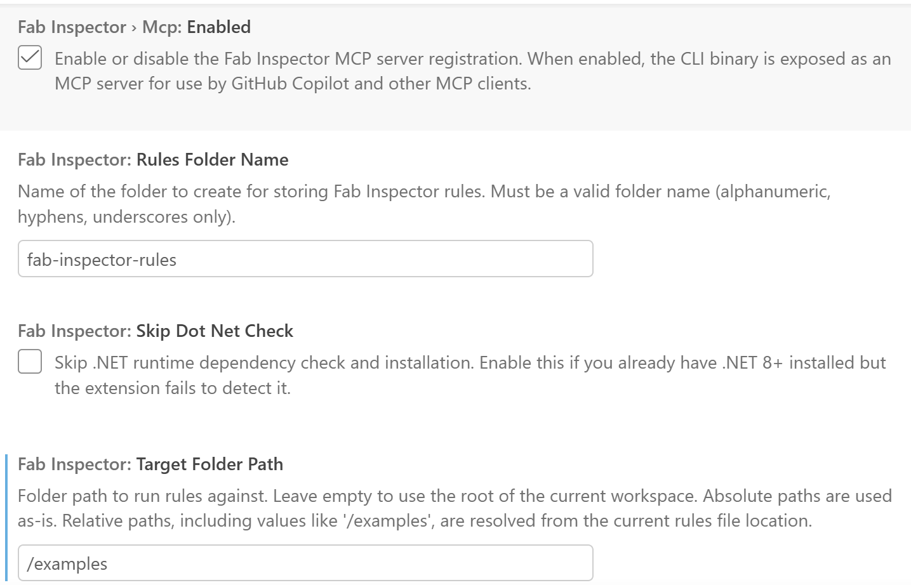
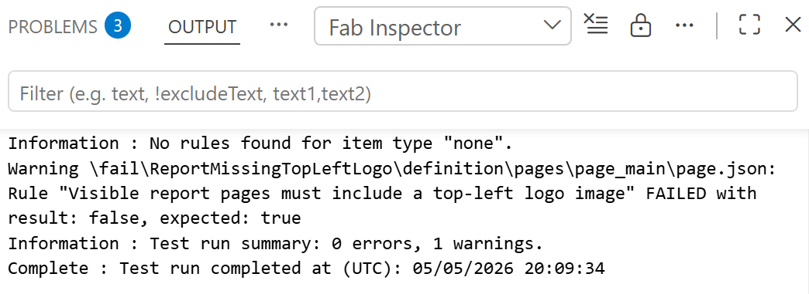

# Fab Inspector Test Harness

A workspace for agentic authoring, testing, and validating [**Fab Inspector**](https://github.com/NatVanG/fab-inspector) rules against Microsoft Fabric item definitions and Fabric API calls. Use it to develop custom governance rules locally, verify them against pass/fail example items, and iterate with AI-assisted rule generation before enforcing them in CI/CD pipelines.

This repo doubles up as a development area for the Fab Inspector agent's instructions as I'm trying to find out what works best. Thanks for any contribution via pull requests.

## Warning

:warning: Rules under `fabric-best-practice-rules/` were generated by AI and are currently untested. Validate behavior and results before relying on them in production or compliance workflows.

## Repository structure

Either clone this repo or use it as a template for your own repository.

| Folder | Purpose |
|---|---|
| `fab-inspector-rules/` | Custom Fab Inspector rules. Each rule lives in its own folder with a `rule.json`, a `README.md`, and `examples/pass` and `examples/fail` Fabric item definitions for local testing. |
| `.ai-assets/` | Rule schemas, example rules, and AI skills that help author and validate rules. |
| `.github/` | Agent and Copilot instruction files for CLI usage and rule authoring guidance. |

## Pre-requisites

:note: Currently this solution only runs on win-x64.

1. **Visual Studio Code** — download from <https://code.visualstudio.com>.

2. **.NET 8+ SDK** - check which SDK's you've installed by running `dotnet --list-sdks`, if under version 8 download from <https://dotnet.microsoft.com/en-us/download>

3. **Azure CLI** - used to sign in to Microsoft Fabric via Entra. Download from <https://learn.microsoft.com/en-us/cli/azure/install-azure-cli-windows?view=azure-cli-latest&tabs=azure-cli&pivots=winget>

4. **Fab Inspector extension** — install from the VS Code Marketplace, see <https://marketplace.visualstudio.com/items?itemName=NatVanG.fab-inspector>  
   This extension wraps the `fab-inspector CLI` to evaluate JSONLogic-based rules against Fabric item definitions and also includes the Fab Inspector MCP server.

   :warning: Ensure that the `fab-inspector CLI` is installed as part of the extension by running the following commands in the VS Code search bar:
   - `> Fab Inspector: Show CLI Info` to see what is there; if not Available or no Age or Last Modified shown then run: 
   - `> Fab Inspector: Update CLI`. After download and extraction, the `Fab Inspector MCP` server should show up when running:
   - `> MCP: List Servers`. Select and start the listed `Fab Inspector MCP` server.

5. **Fabric MCP Server extension** — this should get installed automatically as a dependency of the Fab Inspector extension; if not, install from the VS Code MarketPlace, see <https://marketplace.visualstudio.com/items?itemName=fabric.vscode-fabric-mcp-server>. This extension exposes Microsoft Fabric metadata (item definitions, workload schemas, etc.) to GitHub Copilot through MCP, enabling AI-assisted rule authoring with real schema evidence.

6. **GitHub Copilot** :copilot: (recommended) — the repo includes instruction files and skills that let Copilot generate, explain, and validate Fab Inspector rules using natural-language prompts.

## Quick start

1. Clone this repository and open it in VS Code.
2. Install the extensions listed above.
3. Go to the Fab Inspector extension's Settings and set the following:
   
   

4. Start GitHub Copilot chat :copilot:
5. Select the `Fab Inspector Test Harness` agent from the Agent list (Ctrl+.), set the model to `Auto`.
6. Issue a prompt to create a new `Fab Inspector` rule. Your new rule should be created under `fab-inspector-rules/`. Each new rule folder should contain:
   - `rule.json` — the rule definition using Fab Inspector's JSONLogic format.
   - `examples/pass/` — a Fabric item definition(s) that should pass the rule.
   - `examples/fail/` — a Fabric item definition(s) that should fail the rule.
7. The agent should also then automatically run the newly created rule by invoking the Fab Inspector MCP Server's `Inspect` tool. If the agent discovers that the rule needs the user to authenticate to Microsoft Fabric then it will ask the user if they are signed in. To check if you're signed in, run `az account show` from the terminal, if not then sign in with `az login`.
8. To debug the rule manually, open the created `rules.json`, select a JSON node to inspect, right-click and select command `Fab Inspector: Log Wrap/Unwrap`. Save the file, then right-click the document and select `Fab Inspector: Run Current Rules`. The debug output will be displayed in the VS Code `Output` window.



9. (Optionally) run a rule against a Fabric item folder from the VS Code PowerShell terminal. The Fab Inspector CLI Path can be found using the extension command ('>') `Fab Inspector: Show CLI Info`.

   ```powershell
   ./fab-inspector -fabricitem ".\fab-inspector-rules\<RULE_FOLDER>\examples\pass" -rules ".\fab-inspector-rules\<RULE_FOLDER>\rule.json" -verbose true
   ```

## Example prompts

- "Create a rule that checks if a logo/image is present in the top left hand corner of each visible report page, exclude tooltip and drillthrough pages from the test."
- "Create a rule that returns a list of Report pages that are hidden and are not configured as Tooltip or Drillthrough and cannot be accessed because the report does not have a navigation button for that page."
- "Create a rule that returns a list of Report pages that are hidden and are configured as Drillthrough but are not being referenced by other any pages and therefore unreachable."
- "Create a rule that checks that the Lakehouse names in the context workspace start with `LH_`. Use the Fabric API to get the Lakehouse items for the worspace. Return the names of Lakehouses that fail the test.

## Additional rule ideas to prompt for

### Power BI Report Rules

**1. Approved Custom Theme Enforcement** (`Report`)
Inspect `themeCollection.customTheme.name` in `report.json` and verify it matches an approved corporate theme name. Flags reports using ad-hoc or default themes.

**2. Default Page Names Detected** (`Report`, `Pages` iterator)
Find pages whose `displayName` matches the pattern "Page N" (e.g. "Page 1", "Page 2"). Returns the names of all non-renamed pages as an actionable list.

**3. Visual Overlap on Report Pages** (`Report`, `Pages` iterator)
Use the `rectoverlap` operator against all visible visuals per page to detect any that overlap. Returns pairs of overlapping visual names.

**4. Unapproved Custom Visuals** (`Report`, `Report` part)
Diff the `publicCustomVisuals` array in `report.json` against an approved allowlist defined in the rule's data mapping. Returns any unapproved visual type IDs.

**5. Excessive Page Count** (`Report`)
Count pages using `count` on the `Pages` part and fail if the count exceeds a governance threshold (e.g. 15). Encourages splitting over-crowded reports.

**6. Report Semantic Model Binding Portability** (`Report`, `definition.pbir` part)
Ensure `datasetReference` uses `byPath` (relative path) rather than `byConnection` (hardcoded GUID). A `byConnection` binding breaks when a report is deployed across environments.

**7. Enhanced Tooltips Not Enabled** (`Report`, `Report` part)
Check that `settings.useEnhancedTooltips` is `true` in `report.json`. Enhanced tooltips improve user experience and should be enabled by default.

**8. Cross-Highlight Not Disabled for Slow Sources** (`Report`, `Report` part)
Check that `slowDataSourceSettings.isCrossHighlightingDisabled` is `false`. Disabling cross-highlighting hides valuable interaction features.

### Data Pipeline Rules

**9. Activities Missing Retry Policy** (`DataPipeline`, `pipeline-content.json`)
Filter activities of types `Copy`, `TridentNotebook`, and `SparkJobDefinition` where `policy.retry` is `0` or absent. Returns the names of under-protected activities.
Reference: https://learn.microsoft.com/rest/api/fabric/articles/item-management/definitions/datapipeline-definition#activity-properties

**10. Deprecated InvokePipeline Activity Usage** (`DataPipeline`, `pipeline-content.json`)
Flag any activities with `type: "InvokePipeline"`, which is deprecated. They should be replaced with `ExecutePipeline`.
Reference: https://learn.microsoft.com/rest/api/fabric/articles/item-management/definitions/datapipeline-definition#contentdetails

**11. Web Activity Certificate Validation Disabled** (`DataPipeline`, `pipeline-content.json`)
Flag `WebActivity` or `WebHook` activities where `typeProperties.disableCertValidation` is `true`. This is a security misconfiguration.
Reference: https://learn.microsoft.com/javascript/api/@azure/arm-datafactory/webactivitytypeproperties?view=azure-node-preview

**12. Pipeline Missing Description** (`DataPipeline`, `pipeline-content.json`)
Check that `properties.description` is non-null and non-empty. Undescribed pipelines are hard to govern and document.
Reference: https://learn.microsoft.com/fabric/data-factory/activity-overview#general-settings

**13. ForEach Unconstrained Batch Count** (`DataPipeline`, `pipeline-content.json`)
Find `ForEach` activities where `isSequential` is `false` and `batchCount` is either missing or exceeds a threshold (e.g. 50). Prevents accidental fan-out that overwhelms downstream services.
Reference: https://learn.microsoft.com/fabric/data-factory/foreach-activity

**14. Secure Input/Output Not Enabled on Copy Activities** (`DataPipeline`, `pipeline-content.json`)
Flag `Copy` activities where `policy.secureInput` or `policy.secureOutput` is `false`. Ensures sensitive source/sink data is not written to monitoring logs.
Reference: https://learn.microsoft.com/rest/api/fabric/articles/item-management/definitions/datapipeline-definition#activity-properties

### Copy Job Rules

**15. CopyJob Missing Retry Count** (`CopyJob`, `copyjob-content.json`)
Verify `properties.policy.retry` is set to at least `1`. CopyJobs without a retry are fragile under transient network or service failures.
Reference: https://learn.microsoft.com/fabric/data-factory/what-is-copy-job

**16. CDC Mode Activities Missing Upsert Keys** (`CopyJob`, `copyjob-content.json`)
For CopyJobs with `jobMode: "CDC"`, filter activities where `destination.upsertSettings.keys` is null or empty. Missing keys prevent correct CDC merge behaviour.
Reference: https://learn.microsoft.com/fabric/data-factory/cdc-copy-job

**17. CopyJob Staging Unexpectedly Enabled** (`CopyJob`, `copyjob-content.json`)
Flag activities where `enableStaging: true`. Staging should be intentional — it adds latency and cost and is often left on accidentally.
Reference: https://learn.microsoft.com/fabric/data-factory/what-is-copy-job

### Notebook Rules

**18. Notebook Missing Default Lakehouse Dependency** (`Notebook`, `notebook-content.py`)
Inspect the `# META` block at the top of the notebook content file for a `dependencies` section and flag notebooks where no default Lakehouse is configured. Notebooks without a Lakehouse dependency may fail at runtime.
Reference: https://learn.microsoft.com/fabric/data-engineering/notebook-source-control-deployment#notebook-git-integration

### Workspace-Level API Rules (require `azurecli` auth + `apiget`)

**19. Items Without a Description** (API, `none` itemType, workspace-scoped)
Call `GET /v1/workspaces/{context-fabricworkspace}/items`, filter for items where `description` is null or empty, and return their `displayName` values. Enforces a documentation standard across all item types.
Reference: https://learn.microsoft.com/en-us/rest/api/fabric/core/items/list-items

**20. Item Naming Convention Compliance** (API, `none` itemType, workspace-scoped)
Query all workspace items and flag any whose `displayName` does not match a required prefix or casing convention (e.g. must start with a known domain abbreviation like `FIN_`, `HR_`, `OPS_`). Uses `regexextract` and `filter`.
Reference: https://learn.microsoft.com/power-bi/guidance/powerbi-implementation-planning-workspaces-tenant-level-planning#workspace-naming-conventions

**21. OneLake Workspace Storage Settings Audit** (API, `none` itemType, workspace-scoped)
Call `GET /v1/workspaces/{context-fabricworkspace}/onelake/settings` and verify that expected properties (e.g. log retention or soft-delete) are enabled per governance policy.
Reference: https://learn.microsoft.com/fabric/onelake/onelake-overview

**22. Workspace Contains Lakehouses** (API, `none` itemType, workspace-scoped)
Query `GET /v1/workspaces/{context-fabricworkspace}/items?type=Lakehouse` and verify at least one Lakehouse is present. Workspaces intended for data engineering that lack a Lakehouse are likely misconfigured.
Reference: https://learn.microsoft.com/en-us/rest/api/fabric/core/items/list-items

### Workspace Networking & Security Rules (require `azurecli` auth + `apiget`)

Grounded in the Fabric MCP `docs_best-practices` tool for the `workspace` topic, which exposes the **Workspace Networking Communication Policy** spec (`WorkspaceNetworkingCommunicationPolicy`, `InboundRules`, `OutboundRules`, `NetworkRules.defaultAction`).

**23. Inbound Public Access Must Be Denied** (API, `none` itemType, workspace-scoped)
Call `GET /v1/workspaces/{context-fabricworkspace}/networking/communicationPolicy` and verify `inbound.publicAccessRules.defaultAction` equals `"Deny"`. Workspaces left at the default `Allow` are exposed to any public network and violate a zero-trust baseline.
Reference: https://learn.microsoft.com/en-us/rest/api/fabric/core/workspaces/get-network-communication-policy

**24. IP Firewall Rules Configured When Inbound Is Denied** (API, `none` itemType, workspace-scoped)
Call `GET /v1/workspaces/{context-fabricworkspace}/networking/communicationpolicy/inbound/firewall` and fail when the `rules` array is empty *and* the communication policy's inbound `defaultAction` is `"Deny"`. A locked-down workspace with no allowlist effectively blocks all interactive access — likely a misconfiguration.
Reference: https://learn.microsoft.com/fabric/security/security-workspace-level-firewall-set-up#configure-workspace-ip-firewall-rules

**25. Outbound Public Access Must Be Denied for Data Engineering Workspaces** (API, `none` itemType, workspace-scoped)
Call `GET /v1/workspaces/{context-fabricworkspace}/networking/communicationPolicy` and verify `outbound.publicAccessRules.defaultAction` equals `"Deny"` when the workspace contains `Notebook`, `Lakehouse`, or `SparkJobDefinition` items. Prevents data-exfiltration paths from compute items to arbitrary public endpoints.
Reference: https://learn.microsoft.com/fabric/security/workspace-outbound-access-protection-set-up#enable-workspace-outbound-access-protection

**26. Resource Instance Rules Use Only Approved Subscriptions** (API, `none` itemType, workspace-scoped)
Call `GET /v1/workspaces/{context-fabricworkspace}/networking/communicationpolicy/inbound/azureresources` and filter `rules[].resourceId` so each starts with an approved subscription GUID (defined in the rule's `data` mapping). Catches trust grants to Azure resources outside the governed estate.
Reference: https://learn.microsoft.com/fabric/onelake/onelake-manage-inbound-access-trusted-resources#configure-resource-instance-rules

**27. Resource Instance Rules Require Display Names** (API, `none` itemType, workspace-scoped)
Same `inbound/azureresources` endpoint as #26. Filter `rules[]` where `displayName` is null, empty, or matches a generic pattern (e.g. `"rule"`, `"test"`). Untagged trust entries are unauditable and accumulate as dead allow-list noise.
Reference: https://learn.microsoft.com/fabric/onelake/onelake-manage-inbound-access-trusted-resources#configure-resource-instance-rules

**28. IP Firewall Rules Must Not Contain Wildcard or Broad CIDR Ranges** (API, `none` itemType, workspace-scoped)
From `GET /v1/workspaces/{context-fabricworkspace}/networking/communicationpolicy/inbound/firewall`, filter `rules[]` whose `value` matches `0.0.0.0/0`, ends with `/0`, `/8`, or `/12`. Overly broad allowlist entries silently undo the inbound `Deny` default.
Reference: https://learn.microsoft.com/fabric/security/security-workspace-level-firewall-set-up#configure-workspace-ip-firewall-rules

**29. Workspace Networking Policy Is Explicitly Configured** (API, `none` itemType, workspace-scoped)
Call `GET /v1/workspaces/{context-fabricworkspace}/networking/communicationPolicy` and assert that both `inbound.publicAccessRules.defaultAction` and `outbound.publicAccessRules.defaultAction` are present (not null). An absent policy means the workspace inherits tenant defaults and has never been reviewed.
Reference: https://learn.microsoft.com/en-us/rest/api/fabric/core/workspaces/get-network-communication-policy

**30. Tenant-Wide Networking Policy Audit** (Admin API, `none` itemType, tenant-scoped, requires `Tenant.Read.All`)
Call `GET /v1/admin/workspaces/networkingCommunicationPolicies` (Admin: List Networking Communication Policies) and return any workspace where `inbound.publicAccessRules.defaultAction` or `outbound.publicAccessRules.defaultAction` is `"Allow"`. Produces a tenant-level non-compliance report for security operations.
Reference: https://learn.microsoft.com/en-us/rest/api/fabric/admin/workspaces/list-networking-communication-policies

### Lakehouse & Delta Table Rules

Grounded in Microsoft Learn guidance on [V-Order optimization](https://learn.microsoft.com/fabric/data-engineering/delta-optimization-and-v-order), [cross-workload table maintenance](https://learn.microsoft.com/fabric/fundamentals/table-maintenance-optimization), and [Direct Lake query performance](https://learn.microsoft.com/fabric/fundamentals/direct-lake-understand-storage).

**31. Notebook Spark Session Must Enable V-Order for Gold Workloads** (`Notebook`, `notebook-content.py`)
Scan the notebook body for any of `spark.conf.set('spark.sql.parquet.vorder.default', 'false')`, `SET spark.sql.parquet.vorder.default=FALSE`, or `vorder.enabled = false`. Notebooks producing tables intended for Power BI Direct Lake or the SQL analytics endpoint should keep V-Order enabled (40–60% cold-cache improvement). Returns the offending lines.
Reference: https://learn.microsoft.com/fabric/data-engineering/delta-optimization-and-v-order

**32. Notebook Writing Delta Tables Must Set Optimize-Write** (`Notebook`, `notebook-content.py`)
Detect notebooks that contain `.write.format("delta")` or `saveAsTable(` but do **not** set `spark.microsoft.delta.optimizeWrite.enabled` to `true`. Optimize Write reduces the small-file problem at ingestion time, which downstream OPTIMIZE jobs cannot fully undo.
Reference: https://learn.microsoft.com/fabric/fundamentals/table-maintenance-optimization

**33. Lakehouse Table Maintenance VACUUM Retention Floor** (`Notebook`/`SparkJobDefinition`, content file)
Find any `VACUUM ... RETAIN <n> HOURS` statement where `<n>` is below `168` (7 days). Microsoft Learn warns this corrupts concurrent readers and breaks Delta time travel; the Fabric UI/API rejects shorter retention by default.
Reference: https://learn.microsoft.com/fabric/data-engineering/lakehouse-api#run-table-maintenance-on-a-delta-table

### Semantic Model Rules

Grounded in Microsoft Learn guidance on [Direct Lake query performance](https://learn.microsoft.com/fabric/fundamentals/direct-lake-understand-storage).

**34. Direct Lake Semantic Model Must Disable DirectQuery Fallback** (`SemanticModel`, `model.bim` / TMDL `database.tmdl`)
For models with `mode: "directLake"` tables, verify the model-level property `directLakeBehavior` is `"DirectLakeOnly"` (i.e. fallback disabled). Fallback to SQL endpoint forces hybrid query plans that degrade VertiScan performance even when fallback is not triggered.
Reference: https://learn.microsoft.com/fabric/fundamentals/direct-lake-understand-storage

**35. Direct Lake Tables Must Not Partition on High-Cardinality Columns** (`SemanticModel`, source Delta table)
For source Delta tables backing a Direct Lake table, flag partition columns with cardinality ratios suggesting >1000 distinct values per million rows (heuristic via a sidecar manifest). Direct Lake transcoding is less efficient against many small Parquet files.
Reference: https://learn.microsoft.com/fabric/fundamentals/direct-lake-understand-storage#considerations-and-limitations

**36. Semantic Model Must Use Integer Keys in Relationships** (`SemanticModel`, `model.bim` / TMDL)
Scan `relationships[]` and flag any `fromColumn`/`toColumn` whose `dataType` is `string`. Microsoft Learn explicitly recommends numeric keys in star schemas for billion-row Direct Lake models.
Reference: https://learn.microsoft.com/fabric/fundamentals/direct-lake-understand-storage#what-affects-direct-lake-query-performance

### Warehouse & SQL Analytics Endpoint Rules

Grounded in Microsoft Learn guidance on [Warehouse row-level security](https://learn.microsoft.com/fabric/data-warehouse/row-level-security).

**37. Row-Level Security Policy Must Be Enabled** (`Warehouse`, T-SQL via `sqlquery` or `apiget`)
Query `sys.security_policies` and flag any policy with `is_enabled = 0`. A disabled RLS policy leaves the underlying table unfiltered without any visible indication in code.
Reference: https://learn.microsoft.com/fabric/data-warehouse/row-level-security

**38. Row-Level Security Predicates Must Use SCHEMABINDING** (`Warehouse`, T-SQL)
Query `sys.security_predicates` joined to `sys.security_policies` and flag predicates whose owning policy has `is_schema_bound = 0`. Non-schema-bound policies require additional grants and increase the side-channel attack surface called out in the Microsoft Learn RLS security considerations section.
Reference: https://learn.microsoft.com/fabric/data-warehouse/row-level-security#permissions

**39. Sensitive Columns Must Have Dynamic Data Masking** (`Warehouse`, T-SQL)
Query `sys.masked_columns` and `sys.columns`. For columns whose name matches a sensitive pattern (rule data: `email`, `ssn`, `salary`, `phone`, `dob`, `creditcard`), assert `is_masked = 1`. Surfaces unmasked PII surfaces in the warehouse.
Reference: https://learn.microsoft.com/fabric/data-warehouse/security

### Eventstream & Eventhouse Rules

Grounded in Microsoft Learn guidance on [eventstream settings](https://learn.microsoft.com/fabric/real-time-intelligence/event-streams/configure-settings) and [eventhouse / KQL DB consumption](https://learn.microsoft.com/fabric/real-time-intelligence/real-time-intelligence-consumption).

**40. Eventstream Retention Explicitly Configured** (`Eventstream`, `eventstream.json`)
Verify `properties.retentionInDays` is present and within `[1, 90]`. The default is 1 day; analytics workloads relying on event replay should explicitly choose a longer retention window (and accept the OneLake storage billing implications).
Reference: https://learn.microsoft.com/fabric/real-time-intelligence/event-streams/configure-settings

**41. KQL Database Must Define Retention and Cache Policies** (`KQLDatabase`, `DatabaseProperties.json`)
For each KQL database definition, verify `databaseRetention` and `databaseCache` (or `cachePolicy` / `retentionPolicy` table-level overrides) are set. Microsoft Learn's eventhouse deploy example shows `database_cache = "3d"` and `database_storage = "30d"` — leaving both at defaults is a cost and queryability risk.
Reference: https://learn.microsoft.com/fabric/real-time-intelligence/eventhouse-deploy-with-fabric-api

### Mirrored Database Rules

Grounded in Microsoft Learn guidance on securing [mirrored Azure Database for PostgreSQL](https://learn.microsoft.com/fabric/mirroring/azure-database-postgresql-how-to-data-security) and [mirrored SQL Server](https://learn.microsoft.com/fabric/mirroring/sql-server-security).

**42. Mirrored Database Connection Must Not Use Basic Authentication When Entra Is Supported** (`MirroredDatabase`, `mirroring.json`)
For mirrored sources where Microsoft Entra ID auth is GA (e.g. Azure SQL DB, Snowflake), flag connections whose `credentialType` (or equivalent) is `"Basic"`. Surfaces password-based auth that should be replaced with managed identity or Entra service principal per the principle of least privilege called out in Microsoft Learn.
Reference: https://learn.microsoft.com/fabric/mirroring/sql-server-security

### Naming Convention Rules

Grounded in Microsoft Learn guidance on [Power BI workspace naming conventions](https://learn.microsoft.com/power-bi/guidance/powerbi-implementation-planning-workspaces-tenant-level-planning#workspace-naming-conventions) and the per-item-type name validation rules in the [Create a lakehouse](https://learn.microsoft.com/fabric/data-engineering/create-lakehouse) and [Lakehouse schemas](https://learn.microsoft.com/fabric/data-engineering/lakehouse-schemas) articles. Naming rules are deterministic, high-value governance checks because they run cheaply in CI and surface drift before it reaches production.

A central convention table — defined in each rule's `data` mapping — should pin the approved prefix per item type. Suggested baseline:

| Item type | Prefix | Example |
|---|---|---|
| `Lakehouse` | `LH_` | `LH_Sales_Bronze` |
| `Warehouse` | `WH_` | `WH_Finance_Mart` |
| `Notebook` | `NB_` | `NB_Bronze_Ingest_Orders` |
| `DataPipeline` | `PL_` | `PL_Daily_Refresh_Sales` |
| `CopyJob` | `CJ_` | `CJ_AzureSql_Customers` |
| `Dataflow` | `DF_` | `DF_Customer_Cleanse` |
| `SemanticModel` | `SM_` | `SM_Sales_Star` |
| `Report` | `RPT_` | `RPT_Sales_Executive` |
| `Eventstream` | `ES_` | `ES_Telemetry_Devices` |
| `Eventhouse` | `EH_` | `EH_AppLogs` |
| `KQLDatabase` | `KDB_` | `KDB_AppLogs_Prod` |
| `KQLQueryset` | `KQS_` | `KQS_OnCall_Triage` |
| `Reflex` | `ACT_` | `ACT_HighValue_OrderAlert` |
| `MirroredDatabase` | `MIR_` | `MIR_Snowflake_Sales` |
| `Environment` | `ENV_` | `ENV_Spark_Std34` |
| `SparkJobDefinition` | `SJD_` | `SJD_Gold_Aggregation` |
| `MLModel` / `MLExperiment` | `ML_` / `MLX_` | `ML_Churn_Pred` / `MLX_Churn_Tune` |
| `SQLDatabase` | `SQLDB_` | `SQLDB_OrderEntry` |

**43. Workspace Name Must Follow Approved Pattern** (API, `none` itemType, tenant- or workspace-scoped)
Call `GET /v1/workspaces` (admin) or `GET /v1/workspaces/{context-fabricworkspace}` and verify `displayName` (a) does not contain the redundant words `Workspace`, `Fabric`, or `Power BI`, (b) ends with `[Dev]`, `[Test]`, or no suffix for production, and (c) is shorter than 60 characters to avoid Fabric portal truncation. Returns workspaces that violate the rule.
Reference: https://learn.microsoft.com/power-bi/guidance/powerbi-implementation-planning-workspaces-tenant-level-planning#workspace-naming-conventions

**44. Item Display Name Prefix Matches Item Type** (API, `none` itemType, workspace-scoped)
Call `GET /v1/workspaces/{context-fabricworkspace}/items` and, for each item, look up the required prefix for `item.type` in the rule's `data` mapping (table above). Flag any `displayName` whose prefix does not match. Generalises rule #20.
Reference: https://learn.microsoft.com/en-us/rest/api/fabric/core/items/list-items

**45. Item Display Names Must Be Lakehouse-Safe Identifiers** (API, `none` itemType, workspace-scoped)
For items that materialise OneLake objects (`Lakehouse`, `Warehouse`, `KQLDatabase`, `SQLDatabase`, `MirroredDatabase`), assert `displayName` matches `^[A-Za-z][A-Za-z0-9_]{0,122}$`. Mirrors the Lakehouse name validation documented on Microsoft Learn (must begin with a letter, alphanumeric + underscore only, max 123 chars). Prevents items that work today but break when referenced via SQL or Spark.
Reference: https://learn.microsoft.com/fabric/data-engineering/create-lakehouse#create-a-lakehouse

**46. No Default or Placeholder Names** (API, `none` itemType, workspace-scoped)
From the same `items` payload, flag any `displayName` matching `^(Untitled|New|Copy of |Lakehouse\\d*|Notebook\\d*|Pipeline\\d*|Test\\d*|Temp\\d*|TBD)$` (case-insensitive). Catches abandoned scaffolding.
Reference: https://learn.microsoft.com/power-bi/guidance/powerbi-implementation-planning-workspaces-tenant-level-planning#workspace-naming-conventions

**47. Lakehouse Schema Names Must Be Snake-Case Identifiers** (`Lakehouse`, schema metadata via `dfsget` or T-SQL `INFORMATION_SCHEMA.SCHEMATA`)
Assert each non-system schema name matches `^[a-z][a-z0-9_]*$`. Microsoft Learn restricts schema names to letters, numbers, and underscores; standardising on lower snake-case keeps four-part names (`workspace.lakehouse.schema.table`) consistent across joins.
Reference: https://learn.microsoft.com/fabric/data-engineering/lakehouse-schemas

**48. Lakehouse Table Names Must Follow Medallion Convention** (`Lakehouse`, SQL endpoint / Spark catalog)
For each managed Delta table, verify the table name (a) is lower snake-case, (b) is prefixed with `bronze_`, `silver_`, or `gold_` *or* sits in a schema named `bronze`, `silver`, or `gold`. Encourages explicit medallion layering called out in the Fabric governance baselines.
Reference: https://learn.microsoft.com/azure/cloud-adoption-framework/data/governance-security-baselines-fabric-data-lake-unify-data-platform#1-set-fabric-environment-governance-baseline

**49. Warehouse Object Names Must Use Approved Pattern** (`Warehouse`, T-SQL)
Query `sys.schemas`, `sys.tables`, `sys.views`, and `sys.procedures`. Enforce: schemas snake-case, tables `dim_*` / `fact_*` / `bridge_*` / `stg_*`, views `v_*` or `vw_*`, stored procedures `usp_*`. Returns objects that violate the pattern.
Reference: https://learn.microsoft.com/fabric/data-warehouse/data-warehousing

**50. Notebook File Names Must Match Item Display Name** (`Notebook`, `.platform` + content file)
Compare the `displayName` in `.platform` (with the configured prefix `NB_` stripped) to the on-disk folder/file slug, normalised to snake-case. Mismatches make Git diffs confusing and break automation that resolves notebooks by path.
Reference: https://learn.microsoft.com/fabric/data-engineering/notebook-source-control-deployment#notebook-git-integration

**51. Data Pipeline Activity Names Must Be Descriptive** (`DataPipeline`, `pipeline-content.json`)
Filter `activities[]` where `name` matches `^(Copy data\\d*|Activity\\d*|Untitled\\d*|Notebook\\d*|Script\\d*)$` (the Fabric portal's defaults). Returns the offending activity names; encourages renaming to `<verb>_<object>` format (e.g. `Ingest_Customers`).
Reference: https://learn.microsoft.com/fabric/data-factory/activity-overview#general-settings

**52. Semantic Model Measure Names Must Use Title Case Without Underscores** (`SemanticModel`, `model.bim` / TMDL `measures.tmdl`)
Assert each measure `name` matches `^[A-Z][A-Za-z0-9 %()/.-]*$` (no leading underscore, no snake-case). Measures are user-visible in Power BI report field lists; consistent casing improves the consumer experience. Pair with the existing Approved Custom Theme rule (#1) for a complete report-author governance pack.
Reference: https://learn.microsoft.com/fabric/data-warehouse/semantic-models

**53. Connection Display Names Must Embed Environment and Source Type** (API, `none` itemType, tenant- or workspace-scoped)
Call `GET /v1/connections` and verify each `displayName` matches `^(DEV|TEST|PROD)_[A-Z][A-Za-z0-9]+_[A-Za-z0-9_-]+$` (e.g. `PROD_AzureSql_OrderDb`). Connections without an embedded environment marker are routinely promoted into the wrong stage, especially when bound to deployment-pipeline rule sets.
Reference: https://learn.microsoft.com/fabric/data-factory/ci-cd-with-git-integration-and-deployment-pipelines


## License

Fab Inspector, the Fab Inspector VS Code extension and the Fab Inspector Test Harness are released under the MIT license.